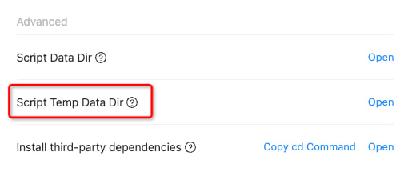

!>Script file operations, such as: read, write, delete, create folders, etc., must in specific directories, the script data directory and the script temporary data directory.

### 1. Script data directory :id=1

> The data in this directory will be saved permanently and will not be cleaned up regularly.

**You can open the directory in `App>Settings`**


**Get the corresponding path in the script. For more usages, please refer to [FAQ>Built-in Modules?](en/question/built-in-module?id=_6)**

```javascript
const { FileUtil } = require('@ttqm/ttqm-support');
const filePath = FileUtil.getScriptDataPath('messageCountMap.json');
FileUtil.createStringFileSync(filePath, '{}');
```

---

### 2. Script temporary data directory :id=2

> The data in this directory will be cleaned up regularly.

**You can open the directory in `App>Settings`**



**Get the corresponding path in the script. For more usages, please refer to [FAQ>Built-in Modules?](en/question/built-in-module?id=_6)**

```javascript
const { FileUtil } = require('@ttqm/ttqm-support');
const filePath = FileUtil.getScriptTmpDataPath('messageCountMap.json');
FileUtil.createStringFileSync(filePath, '{}');
```
