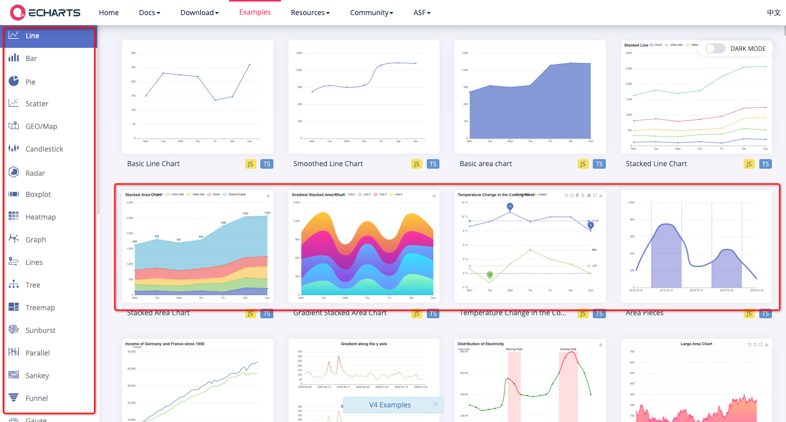
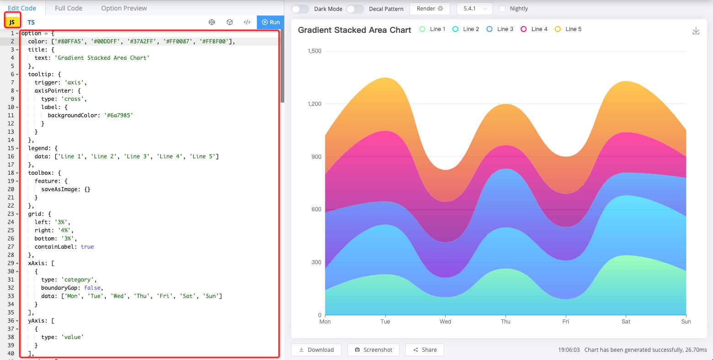
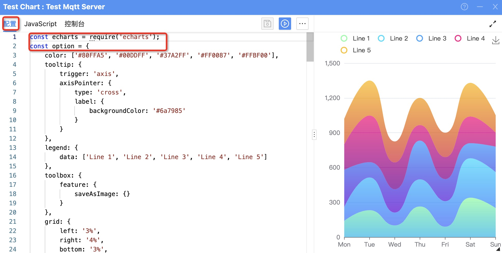
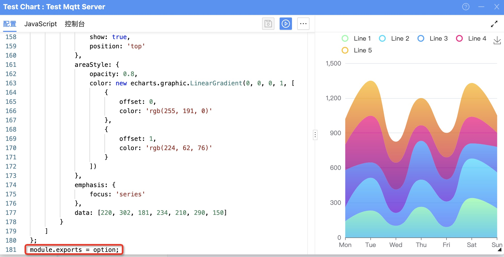
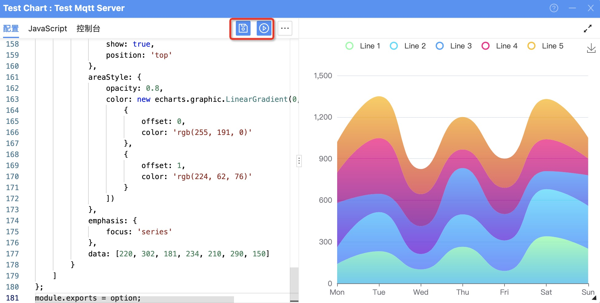
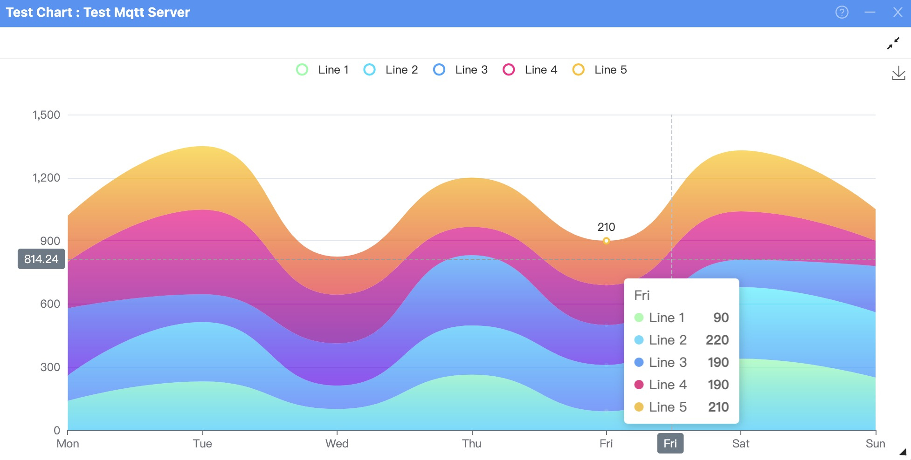

> 圖表配置用來初始化圖表的配置,可以通過內置函數`setOption`配置,也可以通過導出配置`object`或者導出一個`Promise`,在`resolve`中返回圖表配置

---

!>注意:配置腳本有一些限制,由於運行環境是`node.js`,而且是和圖表分離的所欲請注意有一下幾點限制

1. 圖表配置必須在 10s 內返回配置,否則將會被強制終止.
2. 不支持`jQuery`模塊,如果示例中有網絡請求,請參照[常見問題?>如何添加腳本依賴庫?](zh-tw/question/built-in-module?id=_1),進行接口方法的替換
3. 不支持對圖表添加自定義事件

---

### 1.查找自己需要使用的圖表類型,請在[Chart Demo](https://echarts.apache.org/examples/zh/index.html#chart-type-line)選擇需要使用到的圖表類型 :id=1



---

### 2.複製對應的配置腳本 :id=2



---

### 3.粘貼到圖表配置腳本中,代碼最上面面添加變量聲明,結尾添加導出配置代碼 :id=3

**添加變量聲明**

!>因為配置中使用了`echarts`,所以必須在開頭導入`echarts`,以在代碼中使用



**導出配置代碼**



---

### 4.保存並運行,即可看到初始化的圖表 :id=4



---

### 5.完整配置代碼 :id=5

<!-- tabs:start -->

<!-- tab:通過函數配置 -->

```javascript
const echarts = require("echarts");
const option = {
  color: ["#80FFA5", "#00DDFF", "#37A2FF", "#FF0087", "#FFBF00"],
  tooltip: {
    trigger: "axis",
    axisPointer: {
      type: "cross",
      label: {
        backgroundColor: "#6a7985",
      },
    },
  },
  legend: {
    data: ["Line 1", "Line 2", "Line 3", "Line 4", "Line 5"],
  },
  toolbox: {
    feature: {
      saveAsImage: {},
    },
  },
  grid: {
    left: "3%",
    right: "4%",
    bottom: "3%",
    containLabel: true,
  },
  xAxis: [
    {
      type: "category",
      boundaryGap: false,
      data: ["Mon", "Tue", "Wed", "Thu", "Fri", "Sat", "Sun"],
    },
  ],
  yAxis: [
    {
      type: "value",
    },
  ],
  series: [
    {
      name: "Line 1",
      type: "line",
      stack: "Total",
      smooth: true,
      lineStyle: {
        width: 0,
      },
      showSymbol: false,
      areaStyle: {
        opacity: 0.8,
        color: new echarts.graphic.LinearGradient(0, 0, 0, 1, [
          {
            offset: 0,
            color: "rgb(128, 255, 165)",
          },
          {
            offset: 1,
            color: "rgb(1, 191, 236)",
          },
        ]),
      },
      emphasis: {
        focus: "series",
      },
      data: [140, 232, 101, 264, 90, 340, 250],
    },
    {
      name: "Line 2",
      type: "line",
      stack: "Total",
      smooth: true,
      lineStyle: {
        width: 0,
      },
      showSymbol: false,
      areaStyle: {
        opacity: 0.8,
        color: new echarts.graphic.LinearGradient(0, 0, 0, 1, [
          {
            offset: 0,
            color: "rgb(0, 221, 255)",
          },
          {
            offset: 1,
            color: "rgb(77, 119, 255)",
          },
        ]),
      },
      emphasis: {
        focus: "series",
      },
      data: [120, 282, 111, 234, 220, 340, 310],
    },
    {
      name: "Line 3",
      type: "line",
      stack: "Total",
      smooth: true,
      lineStyle: {
        width: 0,
      },
      showSymbol: false,
      areaStyle: {
        opacity: 0.8,
        color: new echarts.graphic.LinearGradient(0, 0, 0, 1, [
          {
            offset: 0,
            color: "rgb(55, 162, 255)",
          },
          {
            offset: 1,
            color: "rgb(116, 21, 219)",
          },
        ]),
      },
      emphasis: {
        focus: "series",
      },
      data: [320, 132, 201, 334, 190, 130, 220],
    },
    {
      name: "Line 4",
      type: "line",
      stack: "Total",
      smooth: true,
      lineStyle: {
        width: 0,
      },
      showSymbol: false,
      areaStyle: {
        opacity: 0.8,
        color: new echarts.graphic.LinearGradient(0, 0, 0, 1, [
          {
            offset: 0,
            color: "rgb(255, 0, 135)",
          },
          {
            offset: 1,
            color: "rgb(135, 0, 157)",
          },
        ]),
      },
      emphasis: {
        focus: "series",
      },
      data: [220, 402, 231, 134, 190, 230, 120],
    },
    {
      name: "Line 5",
      type: "line",
      stack: "Total",
      smooth: true,
      lineStyle: {
        width: 0,
      },
      showSymbol: false,
      label: {
        show: true,
        position: "top",
      },
      areaStyle: {
        opacity: 0.8,
        color: new echarts.graphic.LinearGradient(0, 0, 0, 1, [
          {
            offset: 0,
            color: "rgb(255, 191, 0)",
          },
          {
            offset: 1,
            color: "rgb(224, 62, 76)",
          },
        ]),
      },
      emphasis: {
        focus: "series",
      },
      data: [220, 302, 181, 234, 210, 290, 150],
    },
  ],
};
// 通過內置函數setOption進行配置
setOption(option);
```

<!-- tab:通過同步返回配置 -->

```javascript
const echarts = require("echarts");
const option = {
  color: ["#80FFA5", "#00DDFF", "#37A2FF", "#FF0087", "#FFBF00"],
  tooltip: {
    trigger: "axis",
    axisPointer: {
      type: "cross",
      label: {
        backgroundColor: "#6a7985",
      },
    },
  },
  legend: {
    data: ["Line 1", "Line 2", "Line 3", "Line 4", "Line 5"],
  },
  toolbox: {
    feature: {
      saveAsImage: {},
    },
  },
  grid: {
    left: "3%",
    right: "4%",
    bottom: "3%",
    containLabel: true,
  },
  xAxis: [
    {
      type: "category",
      boundaryGap: false,
      data: ["Mon", "Tue", "Wed", "Thu", "Fri", "Sat", "Sun"],
    },
  ],
  yAxis: [
    {
      type: "value",
    },
  ],
  series: [
    {
      name: "Line 1",
      type: "line",
      stack: "Total",
      smooth: true,
      lineStyle: {
        width: 0,
      },
      showSymbol: false,
      areaStyle: {
        opacity: 0.8,
        color: new echarts.graphic.LinearGradient(0, 0, 0, 1, [
          {
            offset: 0,
            color: "rgb(128, 255, 165)",
          },
          {
            offset: 1,
            color: "rgb(1, 191, 236)",
          },
        ]),
      },
      emphasis: {
        focus: "series",
      },
      data: [140, 232, 101, 264, 90, 340, 250],
    },
    {
      name: "Line 2",
      type: "line",
      stack: "Total",
      smooth: true,
      lineStyle: {
        width: 0,
      },
      showSymbol: false,
      areaStyle: {
        opacity: 0.8,
        color: new echarts.graphic.LinearGradient(0, 0, 0, 1, [
          {
            offset: 0,
            color: "rgb(0, 221, 255)",
          },
          {
            offset: 1,
            color: "rgb(77, 119, 255)",
          },
        ]),
      },
      emphasis: {
        focus: "series",
      },
      data: [120, 282, 111, 234, 220, 340, 310],
    },
    {
      name: "Line 3",
      type: "line",
      stack: "Total",
      smooth: true,
      lineStyle: {
        width: 0,
      },
      showSymbol: false,
      areaStyle: {
        opacity: 0.8,
        color: new echarts.graphic.LinearGradient(0, 0, 0, 1, [
          {
            offset: 0,
            color: "rgb(55, 162, 255)",
          },
          {
            offset: 1,
            color: "rgb(116, 21, 219)",
          },
        ]),
      },
      emphasis: {
        focus: "series",
      },
      data: [320, 132, 201, 334, 190, 130, 220],
    },
    {
      name: "Line 4",
      type: "line",
      stack: "Total",
      smooth: true,
      lineStyle: {
        width: 0,
      },
      showSymbol: false,
      areaStyle: {
        opacity: 0.8,
        color: new echarts.graphic.LinearGradient(0, 0, 0, 1, [
          {
            offset: 0,
            color: "rgb(255, 0, 135)",
          },
          {
            offset: 1,
            color: "rgb(135, 0, 157)",
          },
        ]),
      },
      emphasis: {
        focus: "series",
      },
      data: [220, 402, 231, 134, 190, 230, 120],
    },
    {
      name: "Line 5",
      type: "line",
      stack: "Total",
      smooth: true,
      lineStyle: {
        width: 0,
      },
      showSymbol: false,
      label: {
        show: true,
        position: "top",
      },
      areaStyle: {
        opacity: 0.8,
        color: new echarts.graphic.LinearGradient(0, 0, 0, 1, [
          {
            offset: 0,
            color: "rgb(255, 191, 0)",
          },
          {
            offset: 1,
            color: "rgb(224, 62, 76)",
          },
        ]),
      },
      emphasis: {
        focus: "series",
      },
      data: [220, 302, 181, 234, 210, 290, 150],
    },
  ],
};
module.exports = option;
```

<!-- tab:通過異步返回配置 -->

```javascript
const echarts = require("echarts");
const option = {
  color: ["#80FFA5", "#00DDFF", "#37A2FF", "#FF0087", "#FFBF00"],
  tooltip: {
    trigger: "axis",
    axisPointer: {
      type: "cross",
      label: {
        backgroundColor: "#6a7985",
      },
    },
  },
  legend: {
    data: ["Line 1", "Line 2", "Line 3", "Line 4", "Line 5"],
  },
  toolbox: {
    feature: {
      saveAsImage: {},
    },
  },
  grid: {
    left: "3%",
    right: "4%",
    bottom: "3%",
    containLabel: true,
  },
  xAxis: [
    {
      type: "category",
      boundaryGap: false,
      data: ["Mon", "Tue", "Wed", "Thu", "Fri", "Sat", "Sun"],
    },
  ],
  yAxis: [
    {
      type: "value",
    },
  ],
  series: [
    {
      name: "Line 1",
      type: "line",
      stack: "Total",
      smooth: true,
      lineStyle: {
        width: 0,
      },
      showSymbol: false,
      areaStyle: {
        opacity: 0.8,
        color: new echarts.graphic.LinearGradient(0, 0, 0, 1, [
          {
            offset: 0,
            color: "rgb(128, 255, 165)",
          },
          {
            offset: 1,
            color: "rgb(1, 191, 236)",
          },
        ]),
      },
      emphasis: {
        focus: "series",
      },
      data: [140, 232, 101, 264, 90, 340, 250],
    },
    {
      name: "Line 2",
      type: "line",
      stack: "Total",
      smooth: true,
      lineStyle: {
        width: 0,
      },
      showSymbol: false,
      areaStyle: {
        opacity: 0.8,
        color: new echarts.graphic.LinearGradient(0, 0, 0, 1, [
          {
            offset: 0,
            color: "rgb(0, 221, 255)",
          },
          {
            offset: 1,
            color: "rgb(77, 119, 255)",
          },
        ]),
      },
      emphasis: {
        focus: "series",
      },
      data: [120, 282, 111, 234, 220, 340, 310],
    },
    {
      name: "Line 3",
      type: "line",
      stack: "Total",
      smooth: true,
      lineStyle: {
        width: 0,
      },
      showSymbol: false,
      areaStyle: {
        opacity: 0.8,
        color: new echarts.graphic.LinearGradient(0, 0, 0, 1, [
          {
            offset: 0,
            color: "rgb(55, 162, 255)",
          },
          {
            offset: 1,
            color: "rgb(116, 21, 219)",
          },
        ]),
      },
      emphasis: {
        focus: "series",
      },
      data: [320, 132, 201, 334, 190, 130, 220],
    },
    {
      name: "Line 4",
      type: "line",
      stack: "Total",
      smooth: true,
      lineStyle: {
        width: 0,
      },
      showSymbol: false,
      areaStyle: {
        opacity: 0.8,
        color: new echarts.graphic.LinearGradient(0, 0, 0, 1, [
          {
            offset: 0,
            color: "rgb(255, 0, 135)",
          },
          {
            offset: 1,
            color: "rgb(135, 0, 157)",
          },
        ]),
      },
      emphasis: {
        focus: "series",
      },
      data: [220, 402, 231, 134, 190, 230, 120],
    },
    {
      name: "Line 5",
      type: "line",
      stack: "Total",
      smooth: true,
      lineStyle: {
        width: 0,
      },
      showSymbol: false,
      label: {
        show: true,
        position: "top",
      },
      areaStyle: {
        opacity: 0.8,
        color: new echarts.graphic.LinearGradient(0, 0, 0, 1, [
          {
            offset: 0,
            color: "rgb(255, 191, 0)",
          },
          {
            offset: 1,
            color: "rgb(224, 62, 76)",
          },
        ]),
      },
      emphasis: {
        focus: "series",
      },
      data: [220, 302, 181, 234, 210, 290, 150],
    },
  ],
};
module.exports = new Promise((resolve, reject) => {
  resolve(option);
});
```

<!-- tab:初始化圖表 -->



<!-- tabs:end -->
