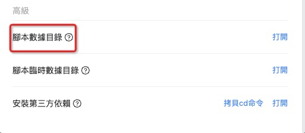

!>腳本操作文件,例如:讀取,寫入,刪除,創建文件夾等,必須在特定的目錄內操作,根據文件有效期,可分為永久腳本數據目錄,腳本臨時數據目錄

### 1.腳本數據目錄 :id=1

> 該目錄的數據將會永久保存,不會定時清理

**在`應用>設置`中可以打開對應的目錄**



**在腳本中獲取對應目錄,更多操作方法請參照[常見問題>有哪些內置的腳本依賴庫?](zh-tw/question/build-in-module?id=_6)**

```javascript
const { FileUtil } = require("@ttqm/ttqm-support");
const filePath = FileUtil.getScriptDataPath("messageCountMap.json");
FileUtil.createStringFileSync(filePath, "{}");
```

---

### 2.腳本臨時數據目錄 :id=2

> 該目錄的數據將會定時清理,所以不應該存儲需要永久化的數據內容

**在`應用>設置`中可以打開對應的目錄**


**在腳本中獲取對應目錄,更多操作方法請參照[常見問題>有哪些內置的腳本依賴庫?](zh-tw/question/build-in-module?id=_6)**

```javascript
const { FileUtil } = require("@ttqm/ttqm-support");
const filePath = FileUtil.getScriptTmpDataPath("messageCountMap.json");
FileUtil.createStringFileSync(filePath, "{}");
```
