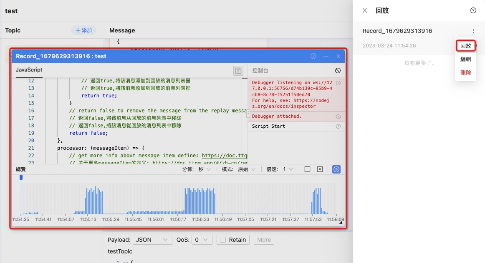
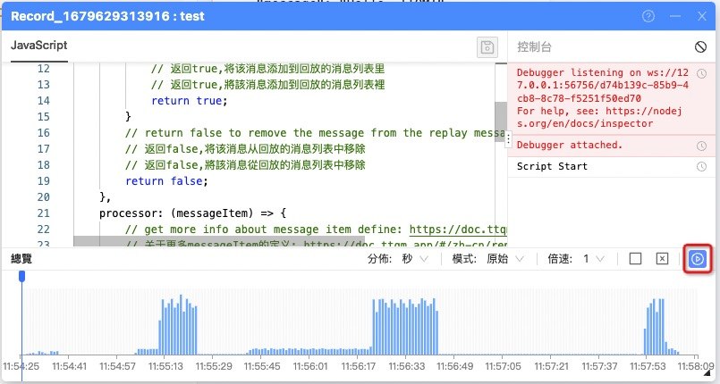
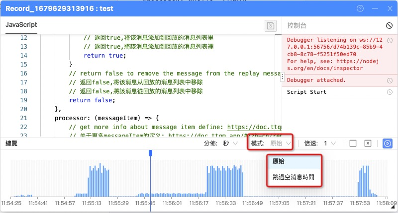
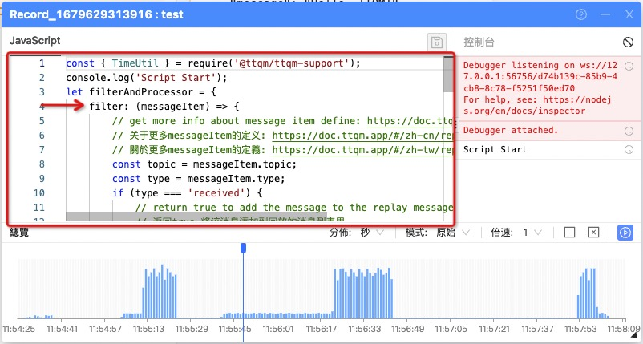

> 本部分將介紹如何使用回放功能

!>刪除客戶端或者清理消息,將會使記錄的消息回放消息被清理,請謹慎.

### 1.點擊開始記錄消息

### 2.停止消息記錄,輸入相關的信息以進行保存

### 3.相關記錄將會保存在列表中

### 4.點擊詳情即可打開回放窗口

### 5.停止和開始

### 6.拖放進度(僅支持在停止時進行進度調整)

### 7.切換倍速和回放模式(僅支持專業版)

### 8.過濾消息

> 通過使用腳本,可對需要回放的消息進行過濾,移除掉不需要回放的消息,支持通過`topic`以及消息內容進行過濾

### 9.處理消息

> 通過使用腳本,可以對回放的消息進行消息處理,更改`topic`以及`消息體內容`,來實現消息的靈活性,例如對消息體中的時間的處理來調整測試消息時間的實時性

### 10.回放腳本描述

!>請勿在腳本的域中使用 `setTimeout` 以及 `setInterval` 等函數,避免更新腳本後,無法暫停該操作,如果您使用了並且影響到您的操作,請關閉窗口後重新打開回放窗口.

_腳本樣例_

[ReplayScriptDemo](../../common/replay/demo-script.md ":include")

!>具体脚本说明,请参见[回放>脚本](zh-cn/replay/script.md)
