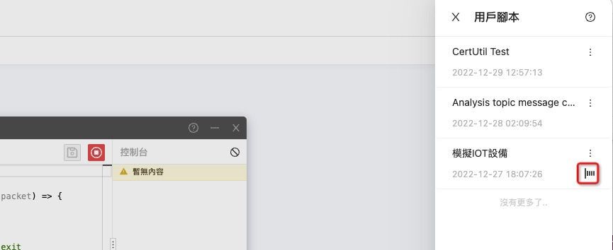

> 用戶腳本可以通過監聽客戶端事件,發送消息,來實現更加複雜的功能,例如:調試設備間的協議,模擬 `IoT` 設備,模擬服務端程序,批量消息發送,消息投遞,永久化等.


---

### 1.創建或者打開已創建的用戶腳本 :id=1

**點擊用戶腳本按鈕**


**打開**


---

### 2.腳本 :id=2

> 用來響應`mqtt`客戶端以及腳本事件來進行對應操作

!>腳本不會自動退出,即使沒有操作也會一直執行,所以可以作為常駐內存應用,支持同時運行多個用戶腳本,例如,一個用來永久化消息投遞,一個用於模擬`iot`設備,一個用於模擬服務器端程序,

```javascript
module.exports = {
  onConnect: () => {
    console.log("iot connected!");
    // 使用內置函數publish發佈在線主題消息
    publish("device/123/type/event/event/online", "{}");
  },
  onMessage: (topic, payload, packet) => {
    // 打印topic
    console.log(`recieved topic:${topic}`);
  },
  onWillExit: () => {
    // 腳本退出前執行,有2秒的時間可以操作,例如保存數據
    console.log("onWillExit");
  },
};
```

---

### 3.運行圖表腳本 :id=3


---

### 4.最小化,和關閉 :id=4

!>最小化,腳本編輯窗口將會隱藏,最小化後,腳本將會繼續運行

!>點擊關閉,將會關閉腳本編輯窗口,並停止腳本執行


!>您可以在腳本列表裡點擊對應的動態圖標來恢復最小化的腳本窗口


